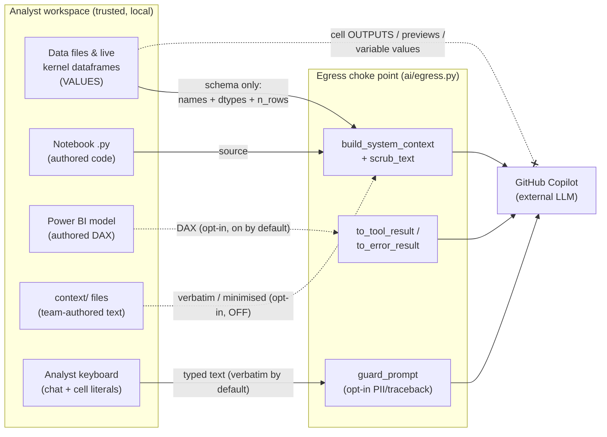

# Threat model: the AI copilot's data-value boundary

This document is written for **security reviewers and model-risk functions at
regulated firms**. It states, precisely and narrowly, what mooring's AI copilot
does and does not guarantee about your data; maps the architecture that backs the
guarantee; and enumerates — adversarially — every path by which a real data
**value** could reach the model, labelling each as *enforced in code*, *held by
convention*, or a *gap*. It is deliberately not reassuring. Where the guarantee is
not enforced structurally, this page says so.

It is the rigorous companion to [Why the copilot can't see your
data](ai-privacy.md): that page explains the design to analysts; this one is the
artifact a reviewer signs off (or doesn't). Where they differ in emphasis, the
code is authoritative and the file/line citations here are how you check it.

!!! warning "One correction up front"
    An earlier internal description called the copilot's load-bearing control a
    "pre-write AST validation gate that stops agent-generated cells executing
    against real data." **That is not what the code does, and this document does
    not claim it.** The AST check that exists (`marimo_rt.py:218`) is a *syntax*
    check, not a security control, and applied cells **do** execute against real
    data in the analyst's kernel — that is the point of the tool. The real
    guarantee is different and narrower: the cell's *outputs never travel back to
    the model*. See [The AST check](#the-ast-check-what-it-is-and-is-not).

## Purpose and scope

**In scope:** the flow of data **values** from an analyst's workspace to the
external Large Language Model that powers the copilot (GitHub Copilot). "Value"
means an actual datum — a cell in a dataframe, a variable's contents, a file's
bytes — as distinct from *schema* (column names and types) and *authored code*
(notebook source, DAX expressions), which the copilot is designed to receive.

**Also in scope:** the confidentiality of **credentials** (the GitHub sync token,
the Copilot login), because they are the second asset a reviewer cares about.

**Out of scope** (stated as explicit non-claims in [Out of scope](#out-of-scope-non-goals)):
the marimo platform's own vulnerabilities, host compromise, a malicious local
user, the model provider's internal data handling, and supply-chain integrity of
mooring's dependencies.

## The security guarantee, stated narrowly

### What mooring claims

> The copilot is given, as the material it reasons over, only: a dataset's
> **schema** (column names + dtype strings + a row count); the schema of
> dataframes **live in the running kernel** (names + dtypes); the notebook's
> **`.py` source**; and — when enabled — a Power BI **semantic model's** authored
> DAX and a team-authored **data dictionary / instructions**. It is not given a
> tool that can read a data file, a cell output, a rendered dataframe, or a kernel
> variable's value, and mooring never transmits those.

This rests on four **structural** properties (properties that would require a
code change to break, and are pinned by tests):

1. **Schema-only toolset, no built-in tools.** The agent is offered *only*
   mooring's own value-free tools (`ai/tools.py`); the SDK's built-in file and
   shell tools are removed via an `available_tools` allowlist
   (`ai/session.py:254-264`), a deny-all `on_permission_request` handler backstops
   any tool the allowlist missed (`ai/copilot.py:455`), and the session runs in an
   **empty temp working directory** (`ai/session.py:229`).
2. **A single outbound choke point.** Every string bound for the model is minted
   in one module: `egress.to_tool_result` / `egress.to_error_result` are the only
   `ToolResult` constructors and `egress.build_system_context` is the only context
   assembler (`ai/egress.py`), enforced by source-grep tests
   (`tests/test_egress.py`).
3. **No output channel is ever opened.** mooring never opens marimo's websocket —
   the only channel that carries cell outputs and variable values. Applying a cell
   writes **source code only**, via marimo's codegen (`ai/cellwrite.py`). The one
   kernel-execution call mooring makes (`KernelControl.run`, `marimo_rt.py:572`)
   discards its HTTP response body.
4. **A hardened SDK session.** The Copilot session is created with the on-disk
   session store, session telemetry, skills, file hooks, host-git, config
   discovery, and embedding retrieval all disabled (`ai/copilot.py:465-484`).

### What mooring does NOT claim

- **It does not claim to stop a human typing a value.** Anything an analyst types
  into a cell literal or the chat prompt is, by design, visible to the model. The
  opt-in PII scan is a best-effort net, not a control (see the vectors table).
- **It does not claim that "column names + types" is value-free.** A column *name*
  can itself be a value — after a pivot/transpose, or in a headerless file — and
  such names do reach the model. This is the largest honest gap; see
  [`schema-value` and `derived-frame`](#data-exposure-vectors).
- **It does not claim the scrubbers are a guarantee.** The structured-PII / secret
  scrubbers in the egress path are **defence in depth** and are explicitly
  documented as such (`ai/egress.py:19-22`). Most of them ship **off by default**.
- **It does not claim anything about the model provider.** The conversation is
  sent to GitHub Copilot's service by design; what happens there is the provider's
  responsibility, not mooring's (see [Out of scope](#out-of-scope-non-goals)).
- **It does not claim the AST check is a data-access control.** It is not one.

## Architecture and components

| Component | File | Role in the boundary |
|---|---|---|
| Context assembler | `ai/egress.py:150` (`build_system_context`) | The one place the system prompt is built; scrubs every fragment. |
| Egress minters | `ai/egress.py:108-147` (`to_tool_result`, `to_error_result`) | The only constructors of a model-bound tool result. |
| Safe toolset | `ai/tools.py` | The value-free tools the agent may call; no file/shell tools. |
| Hardened session | `ai/copilot.py:465` (`hardened_session_kwargs`) | Deny-all permissions + all persistence/discovery off. |
| Session runtime | `ai/session.py` | Long-lived streaming session in an empty working dir. |
| File schema | `schema.py` | Parquet-footer / CSV-header / XLSX-header inspection; names + dtypes + row count only. |
| Live-kernel schema | `ai/introspect.py` | A **frozen** probe over HTTP returning names + dtypes; fail-closed reader. |
| marimo transport seam | `marimo_rt.py` | The only module touching marimo internals (codegen + HTTP control); never the websocket. |
| Cell writer | `ai/cellwrite.py` | Writes proposed **source** into the `.py`; the analyst applies it. |
| Traceback sanitiser | `ai/traceback.py` via `egress.sanitize_traceback` | Fail-closed rewrite of a pasted traceback; only the rewrite is stored. |
| Scrubbers (defence-in-depth) | `ai/pii.py`, `ai/secrets.py`, `ai/ner.py` | Best-effort structured-PII / secret / name detection. |
| Batch planner | `ai/batch.py` | Unattended multi-notebook generation — **still propose-only**; a human applies. |

## Trust boundaries and data flow

There are three trust boundaries. The value-blindness guarantee is about **only
the first one**.

1. **Workspace → Model** (GitHub Copilot). The subject of this document.
2. **Workspace → Team GitHub repo** (the sync path). A *different* boundary: raw
   data files travel here **by design**, governed by the repo's access controls,
   not by any mooring value-blindness claim. See [`sync-source`](#data-exposure-vectors).
3. **App → Admin telemetry sink** (optional, off by default). Counts and identity
   only; see [`telemetry`](#data-exposure-vectors).

The diagram shows what crosses boundary (1) — the model boundary. Solid arrows are
paths that exist in the default configuration; dashed arrows are opt-in.

The crossed dashed line is the guarantee: **cell outputs, dataframe previews, and
variable values have no code path to the model.** Everything reaching the model
goes through the egress choke point. The *values that do cross* are the ones a
human authored (into code, a prompt, DAX, or a context file) or that appear in a
schema position (a column name, a variable name, a row count) — enumerated below.

## Assets protected

| Asset | Where it lives | Primary control |
|---|---|---|
| **Data values** (cell contents, variable values, file bytes) | Kernel, workspace data files | Schema-only tools; no websocket; propose-only writes (structural). |
| **GitHub sync token** | OS keyring, else plaintext file (`auth.py:197`) | Never loaded into model context; keyring at rest. |
| **Copilot login credential** | Managed by the Copilot CLI (`~/.copilot`), reused via `use_logged_in_user=True` | Not handled by mooring; never enters context. |
| **marimo control token** | In-process (`editor.token`) | Loopback-only; the probe reads back names + dtypes only. |

Mooring's own credentials are **not** inserted into `build_system_context`, tool
results, or the prompt — there is no code path that loads them there, so leaking
them to the model would require a code change (enforced). The residual credential
gaps are (a) a credential a **human hard-codes into notebook source** (the model
sees source; the secret scanner is *not* wired onto the model-egress path, only
onto the push and context-ingestion paths — `ai/egress.py:61-82` filters to
checksum-PII only), and (b) the token-at-rest and hub-surface concerns in
[Residual risks](#residual-risks-and-known-limitations).

## Trust assumptions and threat actors

**Assumed trusted:** the analyst's host and OS account; the local processes
running as that user; the private GitHub repo and its access controls; mooring's
own dependency supply chain (see non-goals); the analyst themselves (a determined
insider can always read their own data — mooring reduces *accidental* egress to
the model, not deliberate exfiltration by the operator).

**Threat actors considered:**

- **The model / a prompt-injected model.** Can call any allowlisted tool and
  propose any cell, but has no tool that reads data, and cannot apply a cell.
  *Mitigated structurally.*
- **A curious or careless analyst.** May type a value into a prompt or cell, paste
  a traceback, or apply a cell that pivots data into column headers. *Partially
  mitigated (best-effort, opt-in); this is where the real residual risk sits.*
- **A malicious teammate** who commits a data value as notebook **source**, which
  then reaches a second analyst's model via the source-read tool. *Convention-level
  (best-effort scrub); same category as any authored code.*
- **A local malicious process / malicious web page** on the analyst's machine. The
  hub has no app-layer auth (see [Residual risks](#residual-risks-and-known-limitations)).
  *Not mitigated at the app layer; relies on the loopback bind + OS isolation.*
- **A kernel-resident malicious cell** that duck-types a fake dataframe to push
  attacker-chosen strings through the live-schema probe. *Convention-level; the
  probe reads names, and names are data-controllable.*

## Data-exposure vectors

Each row is one path by which a real data value could reach **the model**.
Classification: **enforced** = structurally prevented (no code path; a code change
would be needed to break it); **convention** = prevented only by current
implementation choices or best-effort scanning that could regress or be bypassed;
**gap** = a value can reach the model today; **mixed** = sub-cases differ. Every
row was adversarially verified against the code.

| Vector | Reaches model? | Classification | Control (file:line) | Residual risk |
|---|---|---|---|---|
| **Cell outputs / dataframe previews** (`.head()`, repr) re-entering context | No | **enforced** | No websocket client exists anywhere; `KernelControl.run` discards the response body (`marimo_rt.py:572`); writes are source-only (`ai/cellwrite.py`) | None via this vector. (An aggregate **row count** *is* sent — metadata, not a preview.) |
| **Derived-frame column names** — a pivot/transpose/crosstab/rename turns data values into headers, which the live probe forwards as "schema" | **Yes** | **gap** | None structural. Only `scrub_columns` (checksum-PII, and only when the PII guard is on — off by default) `ai/tools.py:143` | **Default config leaks.** `df.pivot(on="account_id")` or `df.set_index("customer_name").T` sends those values as column names. This is the sharpest gap. |
| **Schema of a file** carrying values in a schema position | **Yes** | **mixed** | `schema.py` reads footer/header only — parquet min/max stats are **not** read (enforced-closed). But: polars **`Enum`** dtype categories are emitted verbatim by `schema.py` (the live probe strips them, `schema.py` does not); a **headerless** CSV/XLSX promotes row 1 to column names | Enum category strings and headerless-file first-row values reach the model, unscrubbed. Not currently guarded or tested. |
| **Live-kernel probe** as a value channel | **Yes** | **mixed** | Frozen probe (`ai/introspect.py:58-125`), fail-closed reader (`_parse_frames`), unpredictable sidecar + atomic write, localhost auth — all enforced | The `name` / column-name / `n_rows` fields are a *designed* value channel: a value-named variable or a pivoted frame's columns are actual data, only best-effort scrubbed. Value-blind "by construction, not physical impossibility" (acknowledged in code). |
| **Tracebacks** pasted into chat | **Yes** | **mixed** | Sanitiser is fail-closed and default-on; only the sanitised rewrite is stored (`ai/chat.py:329`) — no path forwards the raw paste once **detected** | An **undetected** fragment (e.g. bare `KeyError: 'ACME Ltd'` with no header) is forwarded verbatim through the default-off PII scan; the guard is a weakening-flip from off. |
| **Internal / tool-handler exceptions** during a turn | **Yes** (conditional) | **mixed** | mooring's own `session.send` errors go to the **UI only**, not the model (`ai/session.py:343`); caught tool errors are scrubbed for checksum-PII (`to_error_result`) | **Uncaught** tool-handler exceptions (e.g. polars `ComputeError`, fastexcel `CalamineError` — not in the `ValueError/OSError` catch) propagate to the SDK, which may forward the raw text to the model. **Reliably leaks a file path; plausibly a parse value.** *(SDK behaviour unverified — see open questions.)* |
| **User-typed values** — chat prompt & cell literals | **Yes** | **gap** | Opt-in `guard_prompt` valve (default **off**, `ai_config.py:36`); notebook-source scrub is checksum-PII only | On a default install, a value typed into the prompt is forwarded verbatim; a value written into a cell literal is source the model reads. Documented residual, by design. |
| **Power BI semantic model** DAX | **Yes** | **mixed** | Allowlist parser: partition M, RLS roles, translations, annotations **never parsed** (enforced-excluded, `pbip_model.py`). On by default | Measure/calculated-column **DAX bodies reach the model verbatim** and can embed literal values (a hard-coded customer list in a filter); only checksum-PII scrubbed. Same class as notebook source. |
| **Team context** (`instructions.md` + data dictionary) | Conditional | **mixed** | Default **off** (`ai_config.py:84`, enforced gate); dictionary reduced to a 5-field allowlist (enforced); tools reach only the in-memory index (enforced) | When enabled, `instructions.md` is sent **verbatim** and the dictionary's free-text `description` slot is human text — a value typed there reaches the model, caught only by a best-effort scan. |
| **Sync → teammate → model** | Conditional | **mixed** | `.mooring/` (manifest, undo byte-snapshots, trash, activity) excluded from sync **structurally** (`sync.py:95`); notebooks are source-only (no output/`.ipynb`/`.html` export path exists) | A value committed as a **literal in notebook source** by teammate A is read into teammate B's model via `read_notebook_source`. Same category as any authored code; best-effort scrub only. |
| **Logging** | No | **enforced** (rel. model) | No `logging` module is used; no code path reads any log/journal/session store back into model context | None to the model. (Values can land in the admin telemetry sink — a different boundary, next row.) |
| **Telemetry** | No | **mixed** (rel. model = no) | mooring telemetry default **off** (`config_default.toml`); payloads are counts + machine identity only; SDK session telemetry off | Not a model channel. But if an admin enables it, `telemetry.log_error` ships `str(exc)`, which routinely embeds a **file path** (and conceivably a value) to the admin sink — a boundary other than the model. |
| **mooring's own credentials → model** | No | **enforced** | No code path loads the GitHub/Copilot token into context, tool results, or prompt | A credential a human **hard-codes into notebook source** is not stripped on the model-egress path (secret scanner is on push/context ingestion only). |

## The AST check: what it is, and is not

The brief that commissioned this document described a "pre-write AST validation
gate that stops agent-generated cells executing against real data." **No such
control exists.** Here is precisely what does.

### What it is

`marimo_rt._check_parses` (`marimo_rt.py:218`) runs
`compile(code, "<cell>", "exec", flags=ast.PyCF_ALLOW_TOP_LEVEL_AWAIT)` on a
proposed cell body before it is written to the `.py`. Its **only** effect is to
reject a cell that is not syntactically valid Python. It exists because marimo's
codegen silently wraps an unparseable cell in `app._unparsable_cell(...)`, which
would then no-op in the editor — so mooring fails loud instead of writing garbage
(`marimo_rt.py:218-234`). The seam also validates *structural* correctness on
apply: an edit/delete must match an `anchor` (the cell's source at propose time),
turning a concurrent edit into a loud `CellPatchConflict` rather than a silent
clobber (`marimo_rt.py:406-452`); and the full result is re-parsed before it is
returned (`_finish`, `marimo_rt.py:455`).

### What it allows and blocks

- **Allows:** any syntactically valid Python — including `pl.read_parquet(...)`,
  arbitrary I/O, `print(df)`, network calls, `os.system(...)`. It performs **no**
  import allow/deny-listing, **no** call-graph analysis, and **no** data-access
  inspection.
- **Blocks:** a syntax error; an empty cell; a patch that would empty the
  notebook; a stale/missing anchor; a whole-rewrite result that would not parse.

### Failure modes

- It is a **correctness** gate, not a security gate. It does not, and is not
  designed to, prevent an applied cell from reading real data, printing values, or
  making network requests. **Applied cells execute against real data in the
  analyst's kernel** — that is the intended behaviour.
- The **security-relevant** invariant is elsewhere: because mooring never reads
  cell outputs and never opens the websocket, whatever an applied cell computes
  stays in the analyst's kernel and browser and does **not** return to the model.
  A reviewer should evaluate *that* claim (rows 1 and 4 of the vectors table), not
  the AST check.
- Every write is **human-gated**: the model can only *propose*; the analyst
  reviews a diff and applies it (`ai/tools.py`, `app/apply.py:50` is the sole
  writer). Even unattended **batch** generation is propose-only
  (`ai/batch.py:15-16`) — there is no autonomous write path.

## Out of scope (non-goals)

These are **explicit non-claims**. Mooring does not defend against them, and a
reviewer should treat them as environmental assumptions.

- **marimo platform vulnerabilities.** mooring embeds marimo and inherits its
  security posture. In particular, **CVE-2026-39987** is a **pre-authentication
  remote code execution** in marimo: the terminal WebSocket endpoint
  `/terminal/ws` skipped authentication (CWE-306), letting an unauthenticated
  network attacker obtain a PTY shell (CVSS 9.3 v4.0 / 9.8 v3.1; added to CISA's
  Known Exploited Vulnerabilities catalog). It was **fixed in marimo 0.23.0**.
  mooring **requires and pins `marimo>=0.23.9`** (`pyproject.toml:10`, and the
  asserted runtime floor `MARIMO_FLOOR = (0, 23, 9)` in `marimo_rt.py:38`, checked
  loudly at first use), which clears the fix. **Deployers must not downgrade
  marimo below 0.23.9.** (The advisory sources agree the fix is 0.23.0; they
  differ on the lower bound of the affected range — NVD says "< 0.23.0", the
  GitHub advisory surfaced "< 0.20.4" — but the `>=0.23.9` pin clears it either
  way.)
- **Host compromise.** If the analyst's machine is compromised (malware, a
  keylogger, a rogue admin), all local assets — data, tokens, kernel memory — are
  exposed regardless of mooring.
- **A malicious local user / operator.** The analyst can read their own data by
  definition; mooring reduces *accidental* model egress, not deliberate
  exfiltration by the person running it.
- **The model provider's data handling.** The conversation is transmitted to
  GitHub Copilot's service. Its retention, training, and residency are governed by
  your GitHub Copilot / enterprise agreement, not by mooring. Data residency can
  be steered by signing in to a GitHub Enterprise Copilot instance
  (`--host`), but provider-side handling is outside mooring's control.
- **Supply chain.** mooring depends on marimo, polars, the GitHub Copilot SDK,
  and (optionally) GLiNER/spaCy model weights. Their integrity is out of scope;
  the copilot extra and the NER model weights should pass your own dependency and
  model-risk review (the default NER weights are pinned safetensors, no pickle).

## Deployment assumptions

- **Local-first, loopback-bound.** The hub binds to `127.0.0.1` (`server.py:1024`)
  and is not internet-reachable by default. The marimo editor is a local
  subprocess. Nothing here should be exposed to a network without adding an
  authenticating reverse proxy — the app layer performs **no** authentication (see
  below).
- **Copilot is opt-in and org-gated.** The copilot needs the `mooring[copilot]`
  extra, a Copilot licence, and your org's Copilot CLI/agent policy enabled. With
  none of that, no AI egress occurs at all.
- **The privacy scrubbers default off; the structural controls default on.** A
  default install has the structural guarantees (rows 1, 4 of the table) but
  **not** the PII scan, name detection, or team context. Enabling `[ai.pii]` adds
  the best-effort net; it does not change the structural claim.

## Residual risks and known limitations

Stated plainly, worst-first:

1. **Column names and variable names are not value-free.** After a pivot,
   transpose, or crosstab — ordinary analysis — data values become column headers
   and reach the model via the live-schema probe in the default configuration.
   This is a **gap**, not a hypothetical.
2. **Uncaught tool-handler exceptions may forward raw text to the model.** polars
   / fastexcel error types escape mooring's exception catch and are handled by the
   SDK; this reliably leaks a **file path** and plausibly a parse value, bypassing
   every mooring scrubber. The exact SDK forwarding behaviour is **unverified**
   (the SDK is not vendored here).
3. **The chat prompt and cell literals are wide open by default.** The PII scan
   ships off; nothing intercepts a value a human types until an admin turns it on,
   and even then it catches only well-formed cards/IBANs/NHS numbers/emails/NINOs
   (and, with the extra, names) — not sort codes, account numbers, addresses, or
   free prose.
4. **DAX and team-context text are human-authored value channels.** A literal
   typed into a measure filter or an `instructions.md` reaches the model verbatim.
5. **The hub has no application-layer authentication.** There is no origin check,
   CSRF token, or per-route auth on the hub's API (verified: no auth middleware
   anywhere in `hub/`). Any local process — or, for simple cross-origin requests,
   a malicious web page in the analyst's browser — that reaches the loopback port
   can trigger AI turns (Copilot quota abuse), read value-free config, push local
   content using the stored token, or delete the token. **No endpoint returns a
   token**, so it is a command surface, not a direct token-exfiltration surface.
   Security here rests on the loopback bind and OS process isolation.
6. **Token at rest may be plaintext on Windows.** When no OS keyring is available,
   the GitHub token is written to a file with a `chmod` that is a **no-op on NTFS**
   (`auth.py:208-212`); a warning is printed. On the primary (Windows) platform the
   token then rests with default profile-directory permissions.
7. **The scrubbers are best-effort and mostly checksum-based.** `scrub_text` drops
   only whole lines carrying a checksum-validated card/IBAN/NHS value. A clean scan
   is **not** a value-free guarantee.
8. **Sync history is durable.** A value pushed to the repo (as source or a data
   file) remains in git history even after a `recall`; the repo's own controls
   govern it.

## How a reviewer can independently verify

You do not need to trust this document. Each claim maps to something you can
inspect:

- **Watch the wire.** Run the copilot against a dataset full of sentinel values
  and capture egress (a localhost TLS-terminating proxy against the Copilot CLI,
  or the SDK's own request logging). Confirm no sentinel value appears — then
  deliberately pivot the frame and confirm the *column-name* gap (row 2) does
  surface the header values. This is the single most decisive test.
- **Read three files.** `ai/egress.py` (the only assembler + minter),
  `ai/tools.py` (the entire toolset the agent can call), and `ai/cellwrite.py`
  (the only writer). If a value reaches the model, it goes through the first two.
- **Grep for the output channel.** Search the source for `websocket` / `ws://` /
  `create_connection`; the only hits are docstrings asserting its absence. Confirm
  `KernelControl.run` (`marimo_rt.py:572`) never reads its response body.
- **Run the pinned tests.**
  `uv run pytest tests/test_schema.py tests/test_ai_tools.py tests/test_chat_session.py tests/test_introspect.py tests/test_egress.py tests/test_traceback.py`
  — these plant a `SECRET_VALUE_DO_NOT_LEAK` fixture and assert it never reaches
  the model, and pin the single-choke-point invariants. Note what they do **not**
  cover: there is no test asserting that a *pivoted* column name or a headerless
  file's first row is withheld (rows 2–3), because it is not.
- **Confirm the marimo pin.** `pyproject.toml:10` and `marimo_rt.py:38` — verify
  `>=0.23.9` and that `_require_marimo_floor` fails loud on an older marimo.
- **Confirm the SDK hardening.** `ai/copilot.py:465-484` — the disabled-persistence
  and deny-all flags. (Verifying the SDK *honours* them requires inspecting the
  SDK itself; see open questions.)
- **Live spike.** `scripts/spike_copilot_chat.py` opens a real session and asks the
  agent to read a file; it has no tool to do so.

---

## Assumptions I made in writing this

- I treated the code on the current branch as authoritative and current; version
  numbers (default config values, the marimo floor) are as of this writing.
- I classified every vector **relative to the model boundary** (boundary 1). Where
  a value reaches a *different* boundary (the GitHub repo, the admin telemetry
  sink, local IPC), I said so rather than counting it as a model leak.
- I took the CVE-2026-39987 facts from NVD and the GitHub Advisory Database (both
  cite the fix as marimo 0.23.0), corroborated by third-party reporting — this
  postdates the model's own knowledge, so it rests on those sources, not memory.
- I placed this page under `docs/admins/` beside `ai-privacy.md`, its natural
  sibling, and added it to the site nav (`zensical.toml`) under "AI that never
  sees your data", after "Why it can't see your data". Move it if you would rather
  it lived in the developer/architecture section.

## Open questions for you to confirm

1. **SDK exception forwarding (material).** Does `github-copilot-sdk` forward the
   text of an **uncaught tool-handler exception** to the model as a tool result,
   and in what form? This is the one unscrubbed raw-text path I could not verify
   from this repo (the SDK is not vendored). If it does, residual risk #2 is a
   real value/path leak in the default config, and the fix is to broaden the
   handler catch in `ai/tools.py` to `except Exception`.
2. **SDK on-disk behaviour.** Do `enable_session_store=False` /
   `enable_session_telemetry=False` (`ai/copilot.py:473`) actually prevent the SDK
   and the bundled Copilot CLI from writing any conversation content under
   `~/.copilot` or a cache dir? mooring sets the flags; I did not audit that the
   SDK honours them.
3. **Are the schema-value gaps (rows 2–3) acceptable, or should they be closed?**
   Small, local fixes exist: apply the live probe's `Enum`-stripping in
   `schema.py`; detect/flag headerless files; and route the live-schema column
   names through a value-aware scrub (or, at minimum, document them as a known
   limitation in `ai-privacy.md`, which currently claims the readers "provably
   never return a cell value").
4. **Should the hub gain an origin/loopback-token check?** Residual risk #5 is a
   real local-attack surface. A minimal CSRF/origin guard or a per-session hub
   token would close the browser-based vector without a reverse proxy.
5. **Do you want CVE-2026-39987 stated with this level of specificity**, or
   softened to "a pre-auth marimo RCE fixed in ≥0.23.0"? I stated the specifics
   because a reviewer will look it up; confirm the affected-range caveat is worth
   keeping.
