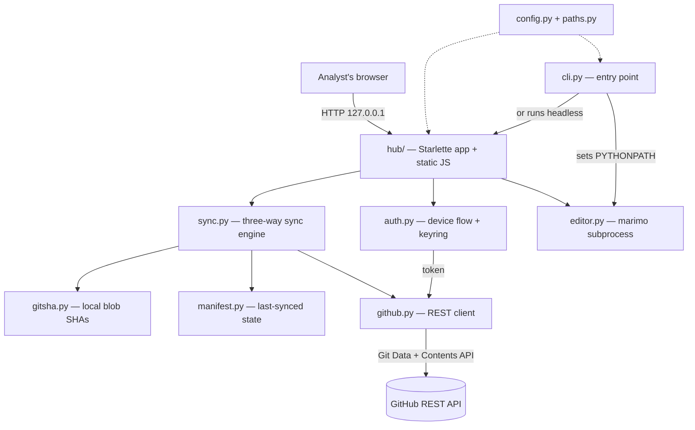

# Architecture

Mooring is a small Python app with three moving parts: a **hub** (local web UI),
a **sync engine** that talks to GitHub without git, and a **marimo editor**
subprocess. This page maps them so you can find your way around the code.

## How the pieces fit



- **`cli.py`** — the entry point (`mooring.cli:main`). Parses subcommands, loads
  config, and dispatches. Critically, it sets `PYTHONPATH` so the marimo
  subprocess can import the bundled packages from inside the packaged artifact
  (see `_ensure_child_pythonpath()`).
- **`hub/`** — a Starlette app bound to `127.0.0.1` plus a vanilla-JS static
  frontend (`hub/static/`). Endpoints are plain sync functions; the frontend
  polls `/api/state` and calls `/api/pull`, `/api/push`, `/api/login/*`, etc.
- **Sync engine** — `sync.py` orchestrates pull/push/resolve using
  `gitsha.py` (computes git blob SHAs locally) and `manifest.py` (remembers what
  was last synced). Comparing local SHA, manifest SHA, and remote SHA gives the
  three-way change detection that makes conflicts explicit.
- **`github.py`** — a thin REST client. Reads via the Git Data API
  (refs → commits → trees → blobs); writes via the Contents API, whose `sha`
  parameter provides per-file optimistic concurrency so a stale write is
  rejected by GitHub rather than clobbering a teammate.
- **`auth.py`** — OAuth device flow and token storage (keyring, with a plaintext
  fallback; `MOORING_TOKEN` overrides).
- **`editor.py`** — starts and tears down the marimo editor subprocess that
  actually edits notebooks.

## Code layout

```
src/mooring/
  cli.py                 entry point; argparse; PYTHONPATH-for-subprocess fix
  config.py              layered config (defaults <- user file <- env)
  paths.py               platformdirs-based config / log / workspace paths
  config_default.toml    baked defaults an admin edits before building
  auth.py                device flow + token storage (keyring)
  github.py              GitHub REST client (Git Data + Contents API)
  gitsha.py              compute git blob SHAs locally
  manifest.py            record of what was last synced
  sync.py                three-way sync engine (pull / push / resolve)
  editor.py              marimo subprocess manager
  notebook_template.py   template for `new`
  hub/
    server.py            Starlette app + endpoints
    static/              index.html, app.js, style.css
```

## Key design choices

- **No git, ever.** Everything goes through the GitHub REST API, so analysts
  need only Python 3.12 or newer.
- **Conflicts are never silent.** Pull skips conflicted files; push relies on
  GitHub's SHA check to reject stale writes.
- **Frozen package stack.** What a notebook can import is fixed at build time;
  there's no pip at runtime.

Ready to make changes? See [Contributing](contributing.md).
