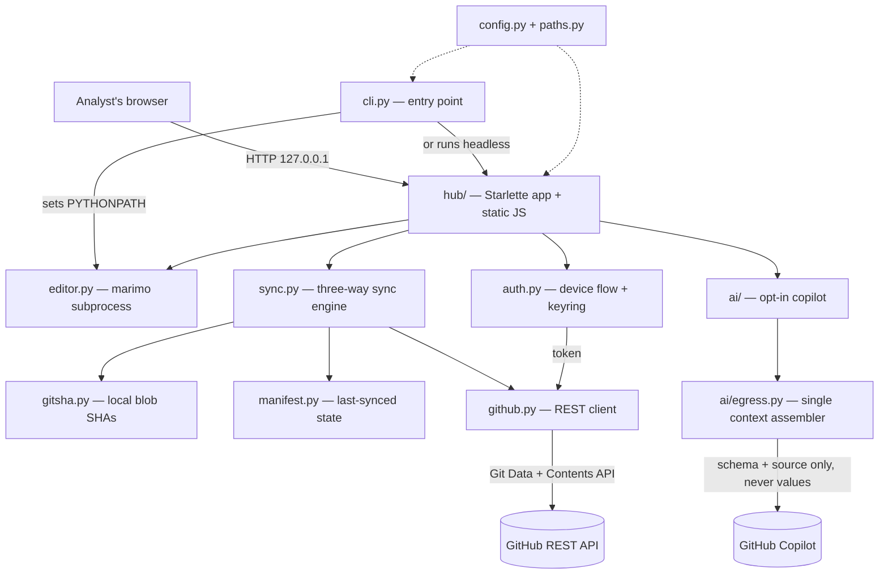

# Architecture

Mooring is a small Python app with four moving parts: a **hub** (local web UI),
a **sync engine** that talks to GitHub without git, a **marimo editor**
subprocess, and an opt-in, schema-only **AI copilot**. This page maps them so you
can find your way around the code.

## How the pieces fit



- **`cli.py`** — the entry point (`mooring.cli:main`). Parses subcommands, loads
  config, and dispatches. Critically, it sets `PYTHONPATH` so the marimo
  subprocess can import the bundled packages from inside the packaged artifact
  (see `_ensure_child_pythonpath()`).
- **`hub/`** — a Starlette app bound to `127.0.0.1` plus a vanilla-JS static
  frontend (`hub/static/`). Endpoints are plain sync functions; the frontend
  polls `/api/state` and calls `/api/pull`, `/api/push`, `/api/login/*`, etc.
- **Sync engine** — `sync.py` orchestrates pull/push/resolve using
  `gitsha.py` (computes git blob SHAs locally) and `manifest.py` (remembers what
  was last synced). Comparing local SHA, manifest SHA, and remote SHA gives the
  three-way change detection that makes conflicts explicit.
- **`github.py`** — a thin REST client. Reads via the Git Data API
  (refs → commits → trees → blobs); writes via the Contents API, whose `sha`
  parameter provides per-file optimistic concurrency so a stale write is
  rejected by GitHub rather than clobbering a teammate.
- **`auth.py`** — OAuth device flow and token storage (keyring, with a plaintext
  fallback; `MOORING_TOKEN` overrides).
- **`editor.py`** — starts and tears down the marimo editor subprocess that
  actually edits notebooks.
- **`ai/`** — the opt-in copilot subpackage. Everything the model sees is
  assembled in **one** place, `ai/egress.py` (`build_system_context`): a
  dataset's schema (column names + dtypes) and the notebook source — never
  values. `ai/tools.py` exposes value-free, propose-only agent tools and Apply
  lands through `ai/cellwrite.py`; `ai/introspect.py` reads live-kernel schemas
  with a fixed, fail-closed probe; `ai/pii.py`, `ai/ner.py` / `ai/ner_spacy.py`,
  and `ai/secrets.py` are opt-in scanners; `ai/datadictionary/` parses team
  context into a five-slot allowlist.

## Code layout

```
src/mooring/
  cli.py                 entry point; argparse; PYTHONPATH-for-subprocess fix
  config.py              layered config (defaults <- user file <- env)
  paths.py               platformdirs-based config / log / workspace paths
  config_default.toml    baked defaults an admin edits before building
  auth.py                device flow + token storage (keyring)
  github.py              GitHub REST client (Git Data + Contents API)
  gitsha.py              compute git blob SHAs locally
  manifest.py            record of what was last synced
  sync.py                three-way sync engine (pull / push / resolve)
  editor.py              marimo subprocess manager (frozen bundle or uv project)
  pyproject_env.py       per-repo notebook deps (pyproject.toml + uv.lock)
  notebook_template.py   template for `new`
  hub/
    server.py            Starlette app + endpoints
    static/              index.html, app.js, style.css
  ai/                    opt-in copilot (schema-only)
    egress.py            single context assembler — the one place context is built
    copilot.py           GitHub Copilot provider + chat session
    tools.py             value-free, propose-only agent tools
    cellwrite.py         applies a reviewed cell patch via marimo codegen
    introspect.py        fail-closed live-kernel schema probe
    pii.py / secrets.py  opt-in outbound scanners (value-free findings)
    ner.py / ner_spacy.py  optional local name detection (off by default)
    datadictionary/      team data dictionary → five-slot allowlist
```

## Key design choices

- **Structurally value-blind copilot.** The copilot is schema-only — it sees your
  column names and types and your notebook's code, but never the data itself.
  Everything the model sees is assembled in a single module —
  `ai/egress.build_system_context` — guarded by tests and an import-linter
  contract. Adding a new path that sends context, or one that skips scrubbing, is
  a review-visible change to that one file. This is the load-bearing privacy
  invariant; don't bypass it. See
  [why the copilot can't see your data](../admins/ai-privacy.md).
- **No git, ever.** Everything goes through the GitHub REST API, so analysts
  need only Python 3.12 or newer.
- **Conflicts are never silent.** Pull skips conflicted files; push relies on
  GitHub's SHA check to reject stale writes.
- **Dependencies live with the repo.** A repo's notebook packages are declared in
  its own `pyproject.toml` + `uv.lock` (synced via GitHub). With uv, `editor.py`
  runs notebooks in that locked env (a frozen `.pyz` carries an admin-built bundle
  from the same file). Mooring itself stays lean.

Ready to make changes? See [Contributing](contributing.md).
