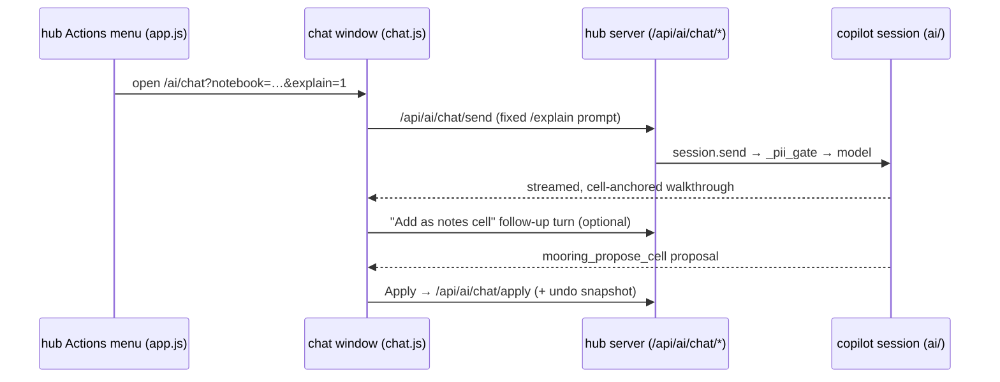

# Handover explainer: explain this notebook

!!! success "Status: implemented"
    All four phases shipped 2026-07: the `/explain` slash command (fixed prompt
    + compact label as pinned pure constants in `chat_core.js`, with a
    `submitMessage(message, visibleLabel)` refactor so `/retry` re-shows the
    compact label too), the hub **Explain** action (`openChatWindow(path, opts)`
    + `&explain=1`, auto-run consumed by a once-per-window flag at both
    readiness paths so a `/model` or effort switch never re-fires it), the
    **Add as notes cell** follow-up (offered on the explain reply when the turn
    goes idle; `notesCellPrompt()` demands `mooring_propose_cell` only, with the
    disclaimer inside the cell), and the docs. Entirely static-JS (L4) as
    designed — zero new Python, endpoints, or config keys, checked by the
    unchanged route-table pin in `tests/test_hub_routes.py`. The optional
    `insert` op (notes cell at the top) remains out of scope.

## Problem

An analyst inherits a teammate's notebook — a leaver, a rotation, month-end
cover — and has to work out what it does, what it reads, what it writes, and
what needs updating each period, before they dare touch it. "Pull the repo and
pick up where a teammate left off" is the product pitch, but today the pickup
step is unaided code-reading, and mooring's analysts are explicitly
non-developers. Often there is no one left to ask.

The copilot already holds everything needed to help: the chat session's system
context carries the notebook source and dataset schemas (assembled in
`build_system_context` in `src/mooring/ai/egress.py`), and the agent can
re-read the notebook cell-by-cell through `mooring_read_notebook_source` in
`src/mooring/ai/tools.py`. What is missing is a one-click way to turn that into
a structured walkthrough — today the inheritor would have to know to open the
AI window and compose the right question themselves.

The output also rots if it lives only in a chat transcript. A walkthrough worth
generating is worth keeping *with the notebook*, where it syncs to the whole
team and greets the next inheritor.

## Design

Two entry points, one existing channel:

- **Hub**: an "Explain" item in the per-file Actions menu (`fileActions` in
  `src/mooring/hub/static/app.js`), shown under the same gate as the existing
  "AI" item (AI enabled, a real notebook, present locally, not AI-disabled).
  Clicking it opens the AI window for that notebook — `openChatWindow` in
  `app.js` builds `/ai/chat?notebook=<path>`, extended with an `&explain=1`
  parameter — and the chat runs `/explain` automatically once the session is
  ready.
- **Chat**: a new `/explain` slash command in the copilot REPL, registered in
  the `COMMANDS` metadata in `src/mooring/hub/static/chat_core.js` and
  dispatched by `runCommand` in `src/mooring/hub/static/chat.js`, so it also
  appears in the existing slash autocomplete (built from `COMMANDS` via
  `filterCommands`); the `/help` listing is a separate hand-maintained table in
  `printHelp`, extended in phase 1.

`/explain` sends one **fixed, value-free prompt** through the ordinary send
path (`/api/ai/chat/send` in `src/mooring/hub/routes/chat.py` → `session.send`
→ the `_pii_gate` prompt valve in `src/mooring/ai/session.py`). The prompt
instructs the model to:

1. call `mooring_read_notebook_source` first — its output enumerates cells as
   `# === cell N ===` blocks, which gives every claim a checkable anchor;
2. produce a walkthrough with fixed sections: **purpose**, **inputs it reads**
   (datasets/paths, using `mooring_get_schema` where useful), **pipeline
   stages** each citing the `cell N` it lives in, **outputs it writes**, and
   **things you would change each period** — dates, paths, and literals spotted
   in the source, each with its cell anchor;
3. open with a fixed header line: *"Generated by the copilot from the notebook
   source — verify against the notebook before relying on it."*

The reply streams into the transcript like any assistant turn (the chat window
already renders streamed markdown, shows the PII badge, and enforces the
per-notebook off-switch). The visible user row reads compactly ("/explain —
walk me through this notebook") rather than dumping the full canned prompt into
the transcript.

**Keeping it with the notebook.** After an explain reply finishes, the reply
card offers an "Add as notes cell" button. It sends a canned follow-up turn
asking the model to propose the walkthrough as a single markdown documentation
cell via the existing `mooring_propose_cell` tool. That proposal flows through
the normal card → Apply → `/api/ai/chat/apply` path, so it gets the same review
step, the same `ApplyGuard.apply_with_undo` byte snapshot
(`src/mooring/app/apply.py` — which also re-checks the per-notebook AI opt-out
under its lock), and the same `--watch` reload in the open editor. The cell
then syncs with the notebook like any other edit.

Two deliberate adaptations from the ideation sketch, following the code:

- **No new one-shot endpoint or read-only hub panel.** The sanctioned AI
  channel in the code is the per-notebook streaming chat session
  (`api_chat_open` / `api_chat_send` / the SSE stream in
  `src/mooring/hub/routes/chat.py`); every prompt passes `_pii_gate`, and the
  disabled-notebook gate is re-checked at each egress (`_disabled_block`). A
  separate one-shot call would duplicate that machinery and create a second
  egress surface to audit. Rendering in the chat window also keeps the output
  on a conversational surface rather than an official-looking report.
- **"Notes cell", not "intro cell".** The wire patch ops in
  `mooring.marimo_rt.CellOp` are `append` / `edit` / `delete` / `replace_all` —
  there is no insert-at-position, so the cell lands at the end of the file.
  Cosmetic only (marimo execution is dataflow-ordered, not top-to-bottom), and
  the model routing through `mooring_propose_cell` — rather than a
  deterministic UI wrapper — also sidesteps the `mo.md` problem: `mo.md` needs
  `import marimo as mo`, and only the model, which can see the source, knows
  whether blindly adding that import would collide with an existing definition.

## Architecture fit

This is an **L4-only feature** in its core phases: every change lives in the
hub's static JS (`chat_core.js`, `chat.js`, `app.js`). There is **no new
module, no new endpoint, no new CLI command, and no new config key** — the
feature is gated by the existing `[ai] enabled` key (`config_default.toml`) and
the synced per-notebook `[ai] disabled_notebooks` opt-out
(`workspace_config.is_ai_disabled`, enforced server-side at open, send, and
apply). The import-linter contracts in `.importlinter` hold trivially: no
Python import changes at all.

Privacy posture: **zero new egress surface**. The fixed prompt is ordinary
prompt text through the existing valve (`egress.guard_prompt` via `_pii_gate`);
the notebook source reaches the model only through the already-scrubbed
channels (`egress.build_system_context`, and `read_notebook_source` in
`ai/tools.py`, which routes its output through `egress.scrub_text`); the
notes cell is written only through the propose → Apply →
`ai/cellwrite.apply_wire_patch` path, which writes source, never values. The
value-blindness spec in [AI privacy](../../admins/ai-privacy.md) needs no
weakening — only a short note that `/explain` is fixed text over the existing
channel.

## Implementation plan

1. **`/explain` slash command** (S)
    - Add `{ name: "explain", help: "walk through what this notebook does" }`
      to `COMMANDS` in `src/mooring/hub/static/chat_core.js`, plus a pure
      `explainPrompt()` returning the fixed prompt text (sections, `cell N`
      anchor requirement, verify-header instruction). Pure metadata, so it is
      Node-testable like the rest of `ChatCore`.
    - Wire a `case "explain"` into `runCommand` in
      `src/mooring/hub/static/chat.js`: print a system row ("generated —
      verify before relying on it"), then send via the existing
      `submitMessage` path with the compact visible label.
    - Extend the `printHelp` rows in `chat.js`. Autocomplete needs no work —
      the menu is built from `ChatCore.filterCommands`.
2. **Hub entry point + auto-run** (S)
    - Extend `openChatWindow` in `src/mooring/hub/static/app.js` to accept an
      options argument and append `&explain=1`.
    - Add `["Explain", …]` in `fileActions` beside the existing `"AI"` entry,
      under the same `aiChatEnabled && isNotebook && file.has_local &&
      !file.ai_disabled` gate; it renders through the existing `actionsMenu`
      dropdown untouched.
    - In `chat.js`, read the new parameter next to the existing `NOTEBOOK`
      URL-param read, and trigger the `/explain` command exactly once when the
      session first reaches the ready/idle state after `openChat` (covering
      both the immediate-`ready` and backgrounded-handshake paths).
3. **"Add as notes cell"** (M)
    - Add a pure `notesCellPrompt()` to `chat_core.js` — the canned follow-up
      asking the model to propose the walkthrough as one markdown
      documentation cell via `mooring_propose_cell`, prefixed with the
      generated-content disclaimer, adapting to whether `marimo` is imported.
    - In `chat.js`, tag the assistant reply that answers an explain turn and
      render the button on its card; clicking sends the follow-up turn. The
      resulting proposal reuses `addProposal` / Apply / Undo unchanged.
4. **Docs** (S)
    - A short user how-to page, plus the one-line note in
      [AI privacy](../../admins/ai-privacy.md) that `/explain` rides the
      existing channel. No admin configuration to document beyond the existing
      AI keys in [Configuration](../../admins/configuration.md).

An optional later phase — an `insert` op in `mooring.marimo_rt.CellOp`,
`cellwrite._ops_from_wire`, and `marimo_rt.apply_cell_patch` so the notes cell
can land at the top — is deliberately out of scope until appended placement
proves to be a real complaint.

## Testing

- **JS (node --test tests/js/)** — extend `tests/js/chat_core.test.js`:
  `parseSlash("/explain")` and `filterCommands("ex")` pick the command up;
  `explainPrompt()` pins the load-bearing wording (requires `cell N` anchors,
  contains the verify header, contains no dataset values or user text — it is
  a constant); `notesCellPrompt()` pins the disclaimer prefix.
- **Python (uv run pytest, offline)** — phases 1–3 change no Python, so the
  job is keeping the existing pins green rather than adding new ones:
  `tests/test_hub.py` already drives `/api/ai/chat/send` with the
  `SECRET_VALUE_DO_NOT_LEAK` fixture and covers the `/api/ai/chat/apply`
  append + undo path this feature rides on; `tests/test_chat_session.py` pins
  the `_pii_gate` valve; `tests/test_ai_tools.py` pins that
  `mooring_read_notebook_source` output is scrubbed and value-free.
- If the optional `insert` op ever lands, it gets pinned in
  `tests/test_marimo_patch.py` and `tests/test_cellwrite.py`.

## Risks and mitigations

- **Confident hallucination trusted by non-devs** — the big one. A wrong
  "change this date each month" claim can cause real damage. Mitigations:
  prompt-forced `cell N` anchors give every claim a checkable reference; the
  fixed verify-first header; rendering in the chat transcript (a conversational
  surface) instead of a report-styled panel; and the notes cell only lands
  through the reviewed propose → Apply path with undo. The residual risk is
  honest: mooring cannot verify the model's claims, only anchor them.
- **Very large notebooks produce shallow or truncated walkthroughs.** The
  session has no token accounting today; the whole source goes into the system
  context and `mooring_read_notebook_source`. The prompt asks for stage-level
  grouping on large notebooks; explaining a cell range is a possible follow-up,
  not in scope.
- **Prompt drift.** The walkthrough shape is enforced only by the prompt, and
  a model may skip anchors. Keeping `explainPrompt()` as a pinned, tested
  constant in `chat_core.js` makes any wording change review-visible.
- **Copilot-extra-only.** Without `mooring[copilot]` (or with `[ai] enabled =
  false`) the action never appears, and the handover problem remains for those
  installs. The non-AI half of the story is the push note in
  [Review my changes](review-my-changes.md) and [Pull digest](pull-digest.md).
- **Auto-run sends a model turn from a hub click.** Bounded: it fires only
  from an explicit "Explain" action, sends fixed value-free text through the
  PII valve, and runs once per window.

## Dependencies and sequencing

- **Independent of the sync-side roadmap** ([Push guard](push-guard.md),
  [Staleness guard](staleness-guard.md), [Local safety net](local-safety-net.md))
  and of the shared cell-differ that [Review my changes](review-my-changes.md)
  and [Pull digest](pull-digest.md) need — the explainer needs no differ. It
  can ship first and cheaply.
- **Copilot-extra-only sibling of the [Traceback fixer](traceback-fixer.md).**
  The fixer must extend the egress choke point (tracebacks can quote values);
  the explainer only *reuses* the channel, so it is the safer one to build
  first and establishes the hub-action → auto-run chat pattern the fixer can
  copy.
- **Pairs with [Pull digest](pull-digest.md)** (what changed since you last
  looked vs what the notebook does) and with
  [Duplicate as draft](duplicate-as-draft.md) — the natural next step after
  reading the walkthrough is experimenting on a draft copy.
- Background: [architecture](../index.md) ·
  [why the copilot can't see your data](../../admins/ai-privacy.md).
