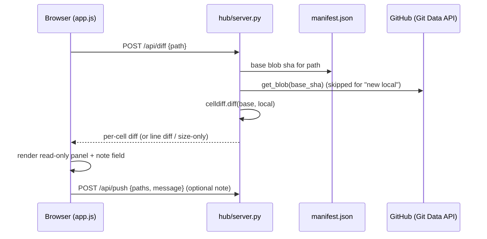

# Review my changes: cell-aware pre-push diff and push note

!!! success "Status: implemented (phases 1–2)"
    Shipped 2026-07: the deterministic cell-aware diff — the new L2
    `src/mooring/celldiff.py` (exact-then-similarity matching with the honest
    "unmatched" bucket, line-diff and sizes-only fallbacks), `POST /api/diff`
    in `hub/routes/files.py`, and the hub's read-only **Review changes** panel —
    plus the optional "What changed?" push note: the hub's `/api/push` and
    `/api/propose` now forward `message` to `sync.push`/`sync.propose`, the
    panel's per-file Push/Propose send the note as the commit message, and the
    note survives the push guard's confirm re-POST (pinned by test). Phase 3
    (the advisory AI summary / risk flags / suggested note) remains open.

## Problem

Pushing is blind. A file row in the hub says `modified`, but a non-developer
analyst cannot answer the question that actually matters before clicking Push:
*"what exactly am I about to publish to the whole team?"* There is no diff
anywhere in mooring — the closest things are Revert (throw everything away) and
"View on GitHub" (which shows the **remote** version, i.e. exactly not your
changes). The result is push anxiety: people sit on finished work for days, or
push half-finished experiments because they've lost track of what a file
contains.

The second half of the problem is history. Every commit mooring writes today is
machine-generated — `sync.push()` defaults to `Update {path} via mooring`
(src/mooring/sync.py, `_push_candidate`) — so the team's GitHub history says
*that* something changed but never *why*. The CLI already accepts
`mooring push -m "..."` (`cmd_push` in src/mooring/cli.py), but the hub — the
surface analysts actually use — never sends a message, and nothing prompts for
one at the natural moment.

Both hurts land on the same person at the same moment: the analyst with a
modified notebook, hovering over Push. This page gives them a cell-aware
"Review changes" view and an optional one-line "What changed?" note, plus an
optional AI summary layer on top.

## Design

A **"Review changes"** action appears in the row Actions menu for every
push-candidate row (`modified`, `new local`, `deleted locally`). It opens a
**read-only** panel:

- For a **marimo notebook** (`.py` that parses through the marimo IR), the
  panel shows the change *per cell*: "Cell 3 — changed" with highlighted
  added/removed lines, "Cell 7 — new", "Cell 2 — removed". Unchanged cells
  collapse to one line. marimo persists no cell identity (see the comment above
  `CellOp` in src/mooring/marimo_rt.py), so matching is heuristic: exact source
  match first, then a similarity pass; anything left lands in an explicit
  **"unmatched"** bucket rendered as removed-then-added, and any parse failure
  on either side falls back to a plain whole-file line diff. Honest beats
  clever here.
- For **other text files** (helper modules, `mooring.toml`, small CSVs): a
  plain unified line diff. This is local-only display on `127.0.0.1` of the
  user's own file — it never goes near the AI (see below).
- For **binary / oversized** files: sizes only ("changed, 2.1 MB → 2.3 MB —
  contents not shown").
- A `new local` file needs no blob fetch (everything is "added"); a
  `deleted locally` file renders the base as all-removed. Local `.py` bytes are
  read via `gitsha.read_for_push` so the diff sees the same LF-normalized text
  that would actually be pushed — otherwise every Windows CRLF flip would show
  as a phantom whole-file change.

At the bottom of the panel: an optional one-line **"What changed?"** input and
`Push` / `Propose` buttons scoped to that file. The note becomes the commit
message — `sync.push()` and `sync.propose()` already accept `message` and pass
it to `GitHubClient.put_file` / `delete_file` (the Contents API's `message`
field); today only the hub drops it on the floor. The note is **optional**:
plain row Push and toolbar "Push all" (`btn-push` in
src/mooring/hub/static/index.html) stay one-click, because mandatory notes
would kill adoption. Review → describe → push is the flow that makes git-free
team history legible, and it is what makes [Pull digest](pull-digest.md)
worth reading.

**Optional AI layer (copilot extra only).** With the AI enabled, the panel
gains an advisory "Summarize this change" section: a one-shot, value-blind
session over the base source + current source + the last-known schema returns
a plain-English summary, risk flags (dropped filter, changed data path,
hardcoded date, reference to a column not in the schema), and a suggested note
that pre-fills the input. All three are clearly labelled as generated and
advisory — **push is never blocked by them**, and a wrong flag costs a shrug,
not trust in the deterministic diff above it.

## Architecture fit

- **New L2 module `src/mooring/celldiff.py`** — the pure differ:
  `diff(base_text, local_text, path)` returning a small dataclass tree
  (per-cell entries with status + line diff, or a line/binary fallback). It
  splits notebooks with `marimo_rt.read_cells` (src/mooring/marimo_rt.py) and
  uses stdlib `difflib` for matching and line diffs; it catches `ValueError` /
  `MarimoTooOld` / `MarimoTransportError` and degrades to the line diff. It
  sits at L2 beside `marimo_rt` and `schema` (the marimo bridge), imports
  nothing above L2, and is **shared with [Pull digest](pull-digest.md)** —
  one differ, two features. `.importlinter` lists no contract for a new L2
  module by default; add `mooring.celldiff` to the `forbidden_modules` of the
  `foundation-is-pure` and `identity-below-domain` contracts so L0/L1 can never
  grow an upward import to it.
- **New endpoint `POST /api/diff`** in src/mooring/hub/server.py (handler
  `api_diff`, registered next to `/api/rollback`). It reads the base sha from
  `manifest.load(workspace).files` and fetches the base blob with the existing
  `GitHubClient.get_blob` — the exact path `sync.revert` already uses,
  including tolerating `NotFound` for a GC'd historical blob. **No change to
  src/mooring/github.py is needed.** Blobs are content-addressed, so the hub
  may cache fetched bases by sha (mirroring the path-keyed, mtime-validated
  `_notebook_cache`).
- **Touched:** `api_push` / `api_propose` in src/mooring/hub/server.py (forward
  an optional `message` to `sync.push` / `sync.propose` — the parameter
  already exists end to end); `fileActions` + a new panel renderer in
  src/mooring/hub/static/app.js; src/mooring/hub/static/index.html +
  style.css for the panel markup. The CLI needs nothing for the note
  (`push -m` exists) and can gain `mooring diff <path>` later; hub and CLI
  wire it separately since the hub must not import the cli.
- **AI phase (L3):** a new assembler `build_review_context(...)` added **in
  src/mooring/ai/egress.py** — tests/test_egress.py pins that egress.py is the
  only place system context is assembled, so the new egress path is a
  review-visible change to that one file, scrubbed with `egress.scrub_text`
  like every other fragment. A new small `src/mooring/ai/review.py` runs the
  one-shot session through `mooring.ai.copilot.CopilotProvider` with
  `hardened_session_kwargs` (reusing the hub's cached provider,
  `_provider_for`), and a new hub endpoint `POST /api/ai/review` gates it.
  The endpoint **hard-restricts input to `.py` notebook source** (the same
  `_is_notebook` sniff the file rows use): a `data/*.csv` diff contains values
  and must never reach the model. ai/ keeps reaching marimo only through
  `marimo_rt` (celldiff is L2, importable from L3 — imports still point down),
  so every import-linter contract holds.

## Implementation plan

**Phase 1 — deterministic diff (M).** Independently shippable; pure
visibility win.

1. Add `src/mooring/celldiff.py`: cell split via `marimo_rt.read_cells`,
   exact-then-similarity matching (`difflib.SequenceMatcher`), an `unmatched`
   bucket, unified line diffs, and the line/binary fallbacks. No network, no
   imports above L2. Register it in the two `.importlinter` forbidden lists.
2. Add `api_diff` to src/mooring/hub/server.py: resolve the path with the
   existing `_ws_file` guards where a local file exists, read the base sha from
   `manifest.load`, fetch the base with `self.client().get_blob`, read local
   bytes via `gitsha.read_for_push`, and return the celldiff result as JSON.
   Route it in the `Route(...)` table beside `/api/rollback`.
3. Wire a "Review changes" row action in `fileActions`
   (src/mooring/hub/static/app.js) for `PUSH_STATES` rows, and render a
   read-only panel (no `contenteditable`, no inputs except Phase 2's note
   field). Put the pure rendering/formatting helpers in a new
   `src/mooring/hub/static/diff_view.js` following the `chat_core.js` pattern
   so `node --test` can cover them.

**Phase 2 — the push note (S).** Ships the input that
[Pull digest](pull-digest.md) depends on.

1. Extend `api_push` and `api_propose` in src/mooring/hub/server.py to read an
   optional `message` string and pass it through to `sync.push` /
   `sync.propose` (both already accept it).
2. Add the "What changed?" field to the review panel footer with per-file
   `Push` / `Propose` buttons (`action("/api/push", { paths: [path], message })`
   in app.js). Keep row Push and toolbar "Push all" one-click and note-free.

**Phase 3 — AI summary and risk flags (M).** Copilot extra only; advisory.

1. Add `build_review_context` to src/mooring/ai/egress.py (base source +
   current source + `schema.format_for_ai` output, each through `scrub_text`).
2. Add `src/mooring/ai/review.py`: one-shot session, fixed prompt asking for
   summary / flags / suggested note as structured text.
3. Add `POST /api/ai/review` to src/mooring/hub/server.py, gated on
   `self.app_cfg.ai_enabled` and hard-restricted to notebook `.py` paths;
   render the advisory section + note prefill in the panel, labelled
   "generated".
4. Update [docs/admins/ai-privacy.md](../../admins/ai-privacy.md): the base
   notebook source is a new outbound fragment (still source-only, still
   scrubbed at the choke point).

## Testing

Offline throughout: the hub and sync tests use the in-memory `FakeClient` in
tests/conftest.py (its `get_blob` serves seeded bytes); github.py itself is
already covered with the `responses` library in tests/test_github.py and needs
no new tests.

- **New tests/test_celldiff.py** — the differ: changed / added / removed /
  reordered cells, the unmatched bucket, exact-match stability, CRLF
  normalization, unparseable-source fallback, binary fallback.
- **Extend tests/test_hub.py** — `/api/diff` happy path against `FakeClient`;
  `new local` (no blob fetch); `deleted locally`; missing base blob tolerated;
  dot-path/traversal rejected (the `_ws_file` guards); push/propose forwarding
  `message` (extend `FakeClient.put_file` to record messages and assert the
  note lands verbatim, with the `Update {path} via mooring` default preserved
  when absent).
- **Extend tests/test_egress.py** — pin the invariants: `build_review_context`
  is defined only in egress.py; every fragment passes `scrub_text`; a
  `SECRET_VALUE_DO_NOT_LEAK` value planted in a data file can never appear in
  a review context (the endpoint refuses non-notebook paths — asserted in
  test_hub.py alongside the existing chat-egress pins).
- **New tests/js/diff_view.test.js** (`node --test tests/js/`) — the pure
  panel helpers: per-cell block building, collapse of unchanged cells,
  escaping of diff text (no HTML injection from notebook source).

## Risks and mitigations

- **The panel quietly becomes an editor.** It must stay read-only — resolving
  a diff hunk in place is a merge tool, a different product. Mitigation: no
  editable regions; the only inputs are the note field and Push/Propose; pin
  with a JS test that the renderer emits no editable elements.
- **Heuristic cell matching lies.** No persisted cell identity means a heavily
  rewritten cell can pair wrongly. Stakes are lower than proposal review (it
  is your own change vs base), but still: the explicit "unmatched" bucket, the
  raw line-diff fallback, and never claiming more than "looks like cell 3".
- **False AI risk flags erode trust.** Flags are advisory, visually separated
  from the deterministic diff, labelled as generated, and never block push.
- **A data-file diff reaching the model.** The `/api/ai/review` endpoint
  allowlists notebook `.py` source only; egress scrubbing backstops; pinned
  leak tests keep it that way. The deterministic local diff of a CSV is fine —
  it never leaves the machine.
- **Note friction kills adoption.** The note stays optional everywhere;
  one-click Push paths are untouched.
- **Stale or missing base blobs.** A conflict-era base can be GC'd on GitHub;
  tolerate `NotFound` exactly as `sync.revert` does and fall back to "no base
  available — showing full file".

## Dependencies and sequencing

- [Pull digest](pull-digest.md) **reuses `celldiff`** and is only legible once
  Phase 2's push note ships — today's machine-generated messages give a digest
  nothing human to say. Ship Phases 1–2 here first.
- [Push guard](push-guard.md) owns the complementary pre-push seam (including
  "recall last push"); this panel's per-file Push should compose with, not
  duplicate, its checks.
- [Version history](version-history.md) is the same "what changed" question
  asked backwards in time; it can reuse the panel renderer.
- Phase 3 follows the same egress-extension pattern as the
  [Traceback fixer](traceback-fixer.md) and, like it and the
  [Handover explainer](handover-explainer.md), is copilot-extra-only.
- Background: [architecture](../index.md) ·
  [AI privacy](../../admins/ai-privacy.md) ·
  [conflicts](../../users/conflicts.md).
